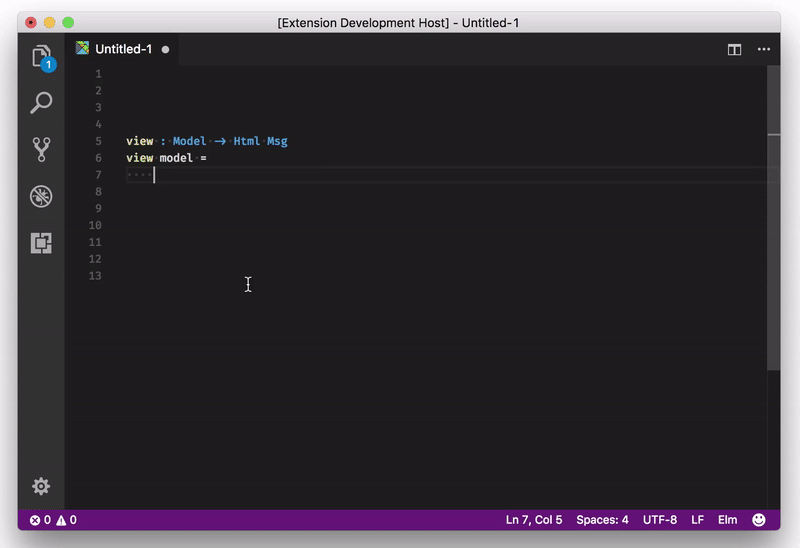
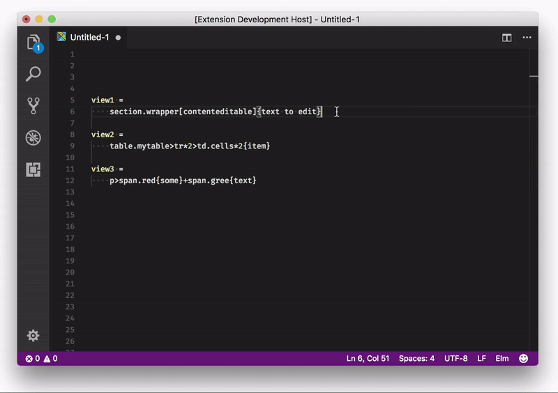

# Elmmet 
### VSCode Emmet to Elm extension
Expand Emmet abbreviation into the composition of Elm functions
>Note: this extension is still in **BETA**, if you got some failures, please, create the issue

## Features
Instead of write first your markup in HTML, then use some third-party services to generate Elm markap from it you can use any valid Emmet abbreviation right in your editor and get valid composition of elm functions

## Known Issues

There is a list of test which is still failing, see https://travis-ci.org/necinc/elmmet  
If you got an issue which looks similar to one of failing test, that means that it will be fixed soon

## Release Notes
### 1.0.0

Initial release of extension.
 - Use [emmetio](https://github.com/emmetio) official [abbreviation](https://github.com/emmetio/abbreviation) parser and [abbreviation extractor](https://github.com/emmetio/extract-abbreviation)
 - Use [elm-format](https://github.com/avh4/elm-format) to format output in [common Elm notation](https://guide.elm-lang.org/install.html#configure-your-editor)
